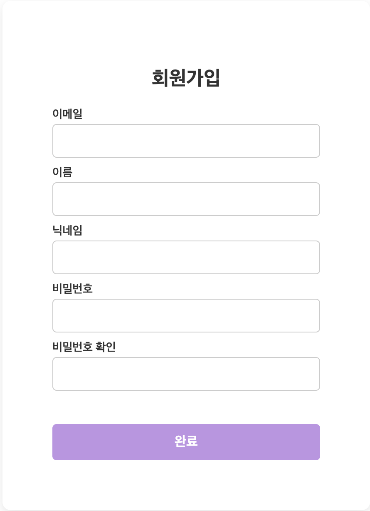
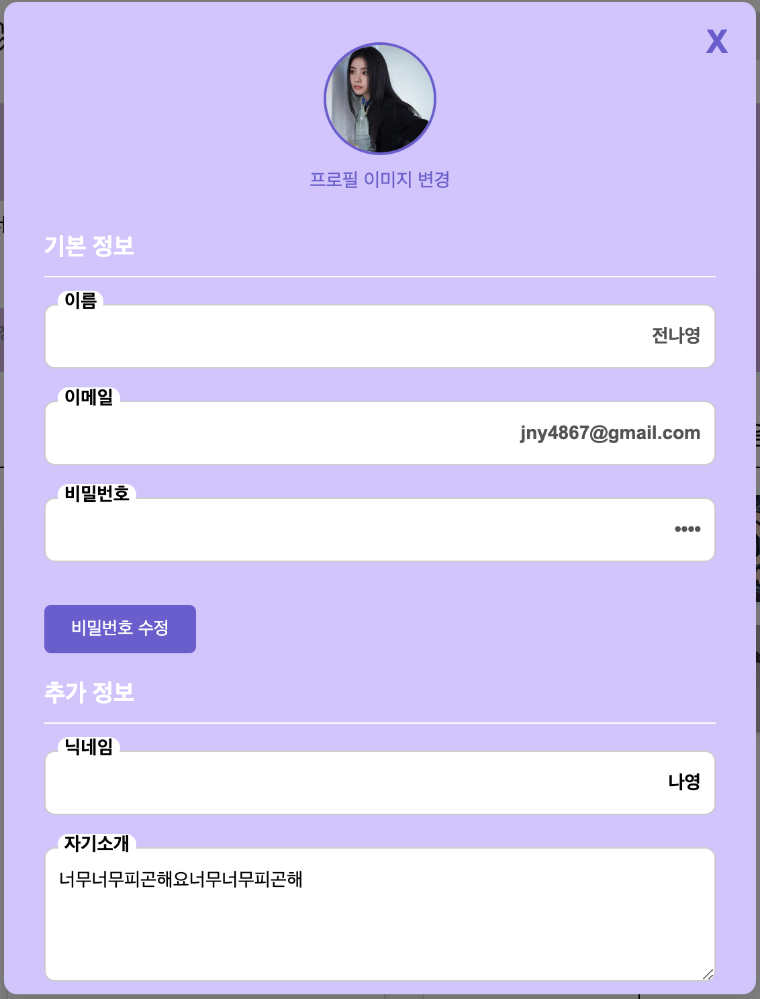

# MUX

## 소개

단순히 음악을 듣는 있는 플랫폼이 아닌, 
다른 사용자들과 연결되어 음악을 **경험**할 수 있는 **커뮤니티**

### 멤버

| 역할 | 성명 | 이메일 |
| --- | --- | --- |
| 팀장 | 이희주 | lhj2778@naver.com |
| 팀원 | 김현빈 | hyunbin6548@gmail.com |
| 팀원 | 이승현 | diakehfgnl08@gmail.com |
| 팀원 | 전나영 | jny200067@gmail.com|
| 팀원 | 정해량 | nyangpc@gmail.com|

### 개발기간

24.09.23 ~ 24.10.07

## MUX의 기능

|로그인|회원가입|
|:--:|:--:|
|- 회원 정보 이메일 ID - 숫자, 영문, 특수문자 조합 PW  |- 이메일 형식 확인  - 비밀번호 확인 인증|
|||

|랜딩 페이지|메인 페이지|
|:--:|:--:|
|- 애니메이션 적용 - 로그인/회원가입 라우팅  |- 유저 섹션 - 추천 포스트 섹션 - 추천 플레이리스트 섹션|
|||

|자작곡 업로드 1|자작곡 업로드 2|
|:--:|:--:|
|- 음원 파일 업로드  |- 앨범 이미지 변경 - 음원 제목, 소개 입력|
|||

|추천 포스트 업로드|
|:--:|
|- YouTube API로 추천곡 불러오기 - 포스트 제목, 내용 입력  |
||

|자작곡 상세 페이지|추천 포스트 상세 페이지|
|:--:|:--:|
|- 음원 재생 기능 - 좋아요, 댓글 기능  |- 음악 재생 기능 - 좋아요, 댓글 기능|
|||

|자작곡-추천 플레이리스트 피드|추천곡 피드|
|:--:|:--:|
|- 자작곡 섹션 - YouTube API 추천 플레이리스트 섹션  |- 추천 포스트 섹션  - 무한 스크롤|
|||

|마이페이지|정보 수정|
|:--:|:--:|
|- 회원정보 수정  |- 로그아웃 버튼 - 업로드한 포스트/ 자작곡 목록|
|||

## 기대효과
- 사용자는 본인의 음악을 커뮤니티에 공유하여 자신의 음악에 대한 타인의 의견을 수렴할 수 있다.
- 사용자가 좋아하는 음악을 포스트하여 다른 사용자들과 공유함으로써 유대감을 형성할 수 있다.
- 사람과의 교류와 유튜브의 추천 플레이리스트를 이용하여 음악 트렌드를 파악하기 쉽다.

## 기술스택
<table>
<tr>
 <td align="center">Language</td>
 <td>
   
 </td>
</tr>
<tr>
 <td align="center">Library</td>
 <td>
  &nbsp  
 &nbsp  
&nbsp 
  </td>
</tr>
<tr>
 <td align="center">Package</td>
 <td>
    &nbsp 
  </td>
</tr>
<tr>
 <td align="center">Bundler</td>
 <td>
    &nbsp 
  </td>
</tr>
<tr>
 <td align="center">Formatter</td>
 <td>
  &nbsp 
 </td>
</tr>
<tr>
 <td align="center">Deploy</td>
 <td>
    &nbsp
 </td>
</tr>

<tr>
  <td align="center">Tools</td>
 <td>
    &nbsp 
    &nbsp
    &nbsp 
    &nbsp  
 </td>
</tr>
<tr>
 <td align="center">IDE</td>
 <td>
    &nbsp
</tr>
</table>
 
 

